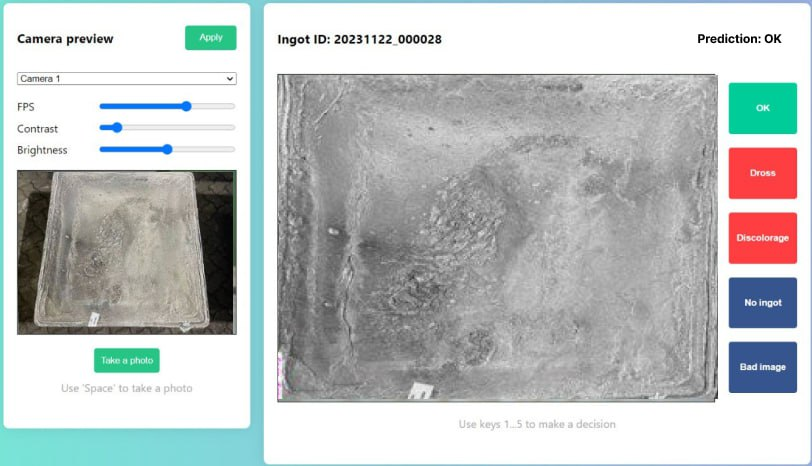

# Ingot Surface Defect Detection

## Project Description
Server application and simple web-client for assessing aluminum ingot defects.

## Demo 


## Feature list
- Camera detection
- Camera settings
- Shortcuts
- Data storage
- Verdict of user
- Image processing
## Frameworks and Technologies used
- Python
- HTML & CSS
- Flask Framework
- CV2

# Installation
## Prerequisites
- Python 3.9

## Prepare to run
### Windows
```bash
cd Prototype/server
pip install -r requirements.txt
```
### Linux/MacOS
```bash
cd Prototype/server
python3 -m venv .venv
source .venv/bin/activate   # only once in new terminal session
pip3 install -r requirements.txt
```
## Run
### Windows
```bash
cd Prototype/server
python flask_server.py
```
And then open `../client/index.html` in browser from the Explore.
### Linux/MacOS
```bash
cd Prototype/server
source .venv/bin/activate   # only once in new terminal session
python flask_server.py
open ../client/index.html   # in another terminal session
```
# Configuration
The server configuration is placed in the `config.ini` file inside the `server` directory.
Currently it contains only paths to the database, logs, and images. You are free to use relative or absolute paths for those directories, but be sure that the user who runs the server will have access to the specified directories. Otherwise the server will fail to run.
# Database
Csv file is a simulation of a database for storing server data.
The file is generated on the basis of images in the output folder (now there are images for demo).

The file looks as follows:


There are 4 columns in this file:
1. id_camera - Camera from which the image was received (so far, always 1, because there is only one camera)
2. id_img - generated image id
3. source_img - absolute path to the image files from aidd/Prototype/client/output
4. text - operator's verdict in text form
# Development
To update pip packages after installing them to the local development environment, run the following commands:
```bash
cd Prototype/server
pip freeze > requirements.txt
```
Then don't forget to make a Merge Request with your changes :)
## Start the server in dev mode
```bash
cd Prototype/server
source .venv/bin/activate   # (Linux/macOS) run only once in new terminal session
pip install -r requirements.txt
pip install -r requirements-dev.txt
flask --app flask_server run
open ../client/index.html
```
# CI/CD
## Prerequisites
Install `pylint` and `pylint-flask`:
```bash
pip install pylint
pip install pylint_flask
```
## Run Flask lint
```bash
pylint --rc-file .pylint.rc Prototype/server/*.py
```
## Run tests
```bash
cd Prototype/server
python -m pytest -v tests
```
# MIT License
Copyright (c) [2023] [Alina Filippenko @a.filippenko; Andrei Chevozerov @a.chevozerov; Aslan Nurlybekov @a.nurlybekov; Nikita Ramzin @n.ramzin]

Permission is hereby granted, free of charge, to any person obtaining a copy
of this software and associated documentation files (the "Software"), to deal
in the Software without restriction, including without limitation the rights
to use, copy, modify, merge, publish, distribute, sublicense, and/or sell
copies of the Software, and to permit persons to whom the Software is
furnished to do so, subject to the following conditions:

The above copyright notice and this permission notice shall be included in all
copies or substantial portions of the Software.

THE SOFTWARE IS PROVIDED "AS IS", WITHOUT WARRANTY OF ANY KIND, EXPRESS OR
IMPLIED, INCLUDING BUT NOT LIMITED TO THE WARRANTIES OF MERCHANTABILITY,
FITNESS FOR A PARTICULAR PURPOSE AND NONINFRINGEMENT. IN NO EVENT SHALL THE
AUTHORS OR COPYRIGHT HOLDERS BE LIABLE FOR ANY CLAIM, DAMAGES OR OTHER
LIABILITY, WHETHER IN AN ACTION OF CONTRACT, TORT OR OTHERWISE, ARISING FROM,
OUT OF OR IN CONNECTION WITH THE SOFTWARE OR THE USE OR OTHER DEALINGS IN THE
SOFTWARE.
