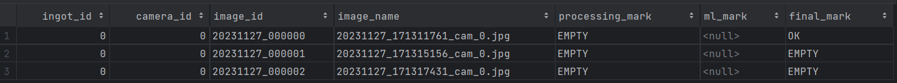

# About:
Prototype server application for operator work with images of aluminum details

## To start:
Install Python 3.9

<b>1) Go to folder: aidd/Prototype/server</b> <br>
<b>2) pip install -r requirements.txt</b> <br>
<b>3) Run csv_generator.py: python csv_generator.py </b> <br>
<b>4) Run flask_server.py: <br> waitress-serve --host=0.0.0.0 --port=5000 flask_server:app </b> <br>
<b>4) Open aidd/Prototype/client/index.html (from Explorer in browser)  </b> <br>

#### About csv:

For the first run, it is necessary to generate a csv file.
Csv file is a simulation of a database for storing server data.
The file is generated on the basis of images in the output folder (now there are images for demo). 

The file looks as follows:


There are 4 columns in this file:
1) id_camera - Camera from which the image was received (so far, always 1, because there is only one camera)
2) id_img - generated image id
3) source_img - absolute path to the image files from aidd/Prototype/client/output
4) text - operator's verdict in text form


# For Developers
To update pip packages:

1) Install target packages
2) Go to folder: aidd/Prototype
3) ```pip freeze > requirements.txt```
4) Push

## Start the server in dev mode
1) Go to folder: aidd/Prototype/server
2) ```pip install -r requirements.txt```
3) Run csv_generator.py: ```python csv_generator.py``` 
4) Run flask_server.py: ```flask --app flask_server run``` (Unscramble the strings to run)
5) Open client/index.html (from Explorer in browser)
